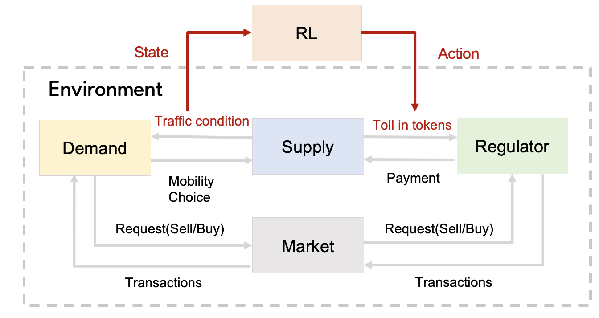

# Deep Reinforcement Learning for Day-to-Day Dynamic Tolling in Tradable Credit Schemes

This repository contains code for the paper: <a href="https://www.tandfonline.com/doi/full/10.1080/21680566.2025.2552884">Deep reinforcement learning for day-to-day dynamic tolling in tradable credit schemes</a>.
 
## Overview
In this project, we investigates reinforcement learning (RL) for day-to-day dynamic tolling optimization within a tradable credit scheme (TCS) framework. Our key contributions include:

- **Formulation**:  We formulate the day-to-day dynamic tolling optimization problem as a Markov Decision Process (MDP) and solve it using RL algorithms.
- **Generalization**: We evaluate the proposed approach across diverse demand and supply scenarios to assess its generalization under unseen events.
- **Robustness**: We examine the robustness of the RL algorithm under various hyperparameter configurations and policy regularization techniques, providing insights into real-world application.

More details about the TCS mechanism and the supply model used in this project can be found in the following works:

- **TCS**:  Chen, Siyu, et al. <a href="https://www.sciencedirect.com/science/article/pii/S0968090X23001109">Market design for tradable mobility credits. </a>
 Transportation Research Part C: Emerging Technologies 151 (2023): 104121.
- **Macroscopic Fundamental Diagram (MFD)**: Liu, Renming, et al. <a href="https://www.tandfonline.com/doi/full/10.1080/21680566.2022.2083034">Managing network congestion with a trip-and area-based tradable credit scheme. </a> Transportmetrica B: Transport Dynamics 11.1 (2023): 434-462. Code available at  <a href="https://github.com/RM-Liu/MFD_TCS">RM-Liu/MFD_TCS</a>. 

<div align="center">
  
  <br>
  <em>Figure 1: Framework.</em>
</div>

## Setup Instructions
### Python Settup
```bash
cd ~/RL4TCS
python3.9 -m venv .venv
source .venv/bin/activate
```

### Install Dependencies
```bash
pip install --upgrade pip
pip install -e gym-custom-env/
pip install -r requirements.txt
```

## Quick Start Example

Train a policy in a 3-dimensional tolling environment (A, mu, sigma) under the TCS (Trinity) scenario:

```bash
cd ..
python3 RL4TCS/main.py env_id=CommuteEnv_A_mu_sigma scenario=Trinity seed=111 resume=False
```

To launch a batch training job with Slurm:
```bash
cd ..
sbatch RL4TCS/main.job
```

### Command-line Arguments

| Argument       | Description                                                                 |
|----------------|-----------------------------------------------------------------------------|
| `env_id`       | The environment ID. Example: `CommuteEnv_A_mu_sigma`                        |
| `scenario`     | Simulation scenario. Could choose between  `Trinity`  or `CP`(Congestion pricing)   or `NT` (No Tolling)                                  |
| `seed`         | Random seed for reproducibility                                             |
| `resume`       | Whether to resume from a specific training (`True` or `False`)                              |
| `resume_path`  | Path to the checkpoint folder (used when `resume=True`)                     |
| `log_name`     | Custom name for the log directory for tensorboard                                          |
| `absolute_change_mode`     | Whether to use absolute change mode in toll update                         |
| `initialization`           | Initialization type: `'NT'`, `'random'`, `'best'`                          |
| `toll_type`                | Type of tolling applied: `'normal'` or `'step'`                            |
| `supply_model`             | Traffic model used, e.g., `'MFD'` or `'Bottleneck'`                        |
| `state_shape`              | Shape of the observation space                                             |
| `allocation.capacity`      | Total credits/toll capacity for the system                                 |
| `n_envs`                   | Number of parallel environments used for sampling                          |
| `train_episode`            | Total number of training episodes                                          |
| `evaluation_time_episode`  | Duration (in time units) for each evaluation episode                       |
| `training_n_epochs`        | Number of training epochs per update cycle                                 |
| `simulation_day_num`       | Total number of simulated days per training run                            |
| `save_episode_freq`        | Frequency (in episodes) for saving training logs/statistics                |
| `checkpoint_save_episode`  | Frequency (in episodes) to save model checkpoints                          |
| `training_n_episode`       | Number of rollout episodes per environment before updating the policy      |
| `eval_freq_episode`        | Frequency (in episodes) to evaluate the policy                             |
| `batch_size_episode`       | Size of the mini-batch for policy updates                                  |
| `std_weights`              | Weight for standard deviation loss penalty                                 |
| `pt_weights`               | Weight for the main policy training loss                                   |
| `device`                   | Hardware device for training, e.g., `'cpu'` or `'cuda'`                    |
| `training_entropy_coef`    | Coefficient for entropy regularization (encourages exploration)            |
| `training_learning_rate`   | Learning rate schedule or fixed value                                      |
| `training_gae_lambda`      | Lambda for Generalized Advantage Estimation (GAE)                          |
| `training_clip_range`      | PPO clipping range to prevent policy update overshooting                   |
| `training_gamma`           | Discount factor γ for future rewards                                       |
| `training_target_kl`       | Target KL divergence between old and new policies                          |
| `reward_scheme`            | Reward structure used, e.g., `'triangle'`, `'step'`                        |
| `reward_weight`            | Weight multiplier applied to environment rewards                           |
| `num_of_users`             | Number of simulated users/agents in the environment                        |
| `training_log_std_init`    | Initial log standard deviation value for stochastic policies               |
| `seed`                     | Random seed for reproducibility                                            |
| `policy_kwargs.net_arch`   | Hidden layer sizes in the policy network architecture (e.g., `[8, 8]`)     |
| `policy_kwargs.log_std_init` | Initial log std dev for the policy                                       |
| `user_params.lambda`       | Parameter λ representing user preference or sensitivity                    |
| `user_params.gamma`        | Parameter γ for user-specific behavior modeling                            |
| `user_params.hetero`       | Degree of heterogeneity in the user population                             |
| `scenario`                 | Scenario name (used for file paths and logging)                            |
| `mode`                     | Mode of execution: `'train'` or `'eval'`                                   |

## File Strucutre
```php
gym-custom-env/
│
├── gym_custom_env/
│   ├── __pycache__/
│   ├── envs/
│   │   ├── __pycache__/
│   │   ├── __init__.py
│   │   ├── Bottleneck_env.py
│   │   ├── commute_env_A_mu_sigma.py
│   │   ├── commute_env_A_mu.py
│   │   ├── commute_env_A_sigma.py
│   │   ├── commute_env_A.py
│   │   ├── commute_env_base.py
│   │   ├── commute_env_mu_sigma.py
│   │   ├── commute_env_mu.py
│   │   ├── commute_env_sigma.py
│   │   └── MFD_env.py
│   │
│   ├── wrappers/
│   │   └── __init__.py
│   │
│   └── gym_custom_env.egg-info/
│
├── statistics/
│   └── statistics for 1-dim-RL-MFD-eval.ipynb
│
├── output/ 
│   ├── MFD        # Input from NT output to calculate social welfare
│   └── BO_new_MDP # BO output
│
├── config.py 
├── helper.py 
├── main.job
├── main.py
├── requirements.txt
└── setup.py
```
### Environment variants

| Environment File            | Description                                                                 |
|-----------------------------|-----------------------------------------------------------------------------|
commute_env_base.py         | Base class with shared logic for all commute environments.                  
|commute_env_A.py            |  Commute environment within 1-dim action space: only update `A` (Amplitude) |
|commute_env_A_mu.py         |  Commute environment within 2-dim action space: update  `A` (Amplitude)  and `mu` (Mean)|
|commute_env_A_mu_sigma.py         |  Commute environment within 3-dim action space: update  `A` (Amplitude)  and `mu` (Mean) and `sigma` (std)|
|commute_env_mu.py            |  Commute environment within 1-dim action space: only update `mu`.|
|commute_env_mu_sigma.py         |  Commute environment within 2-dim action space: update  `mu` and `sigma`.|
|commute_env_sigma.py         |  Commute environment within 1-dim action space: update `sigma`.|
| Bottleneck_env.py           | Bottleneck-based simulation.            |
| MFD_env.py                  | MFD-based simulation        |

## Citation
If you use this work, please cite:

> Wu, X., Seshadri, R., Rodrigues, F., & Lima Azevedo, C. (2025). Deep reinforcement learning for day-to-day dynamic tolling in tradable credit schemes. Transportmetrica B: Transport Dynamics, 13(1). https://doi.org/10.1080/21680566.2025.2552884

📄 [View citation file](./citation.cff)  
📚 [View the paper](https://doi.org/10.1080/21680566.2025.2552884)

## Contact
- Xiaoyi Wu - [xiawu@dtu.dk]
- Denmark Technical University

